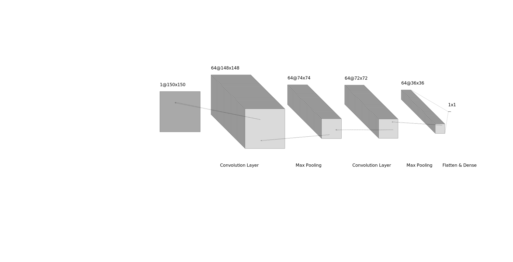

# Brain Tumor Detection

A predictive Deep Learning Model trained on MRI images of Brain for Tumor Detection.
This application aims to provide prior diagnosis for the existence of a tumor
in a given brain MRI image.

### Model Architecture

```py
model = Sequential()
model.add(Conv2D(64, (3,3), input_shape = X_train.shape[1:]))
model.add(Activation("relu"))
model.add(MaxPooling2D(pool_size = (2,2))) # Pooling

model.add(Conv2D(64, (3,3), input_shape = X_train.shape[1:]))
model.add(Activation("relu"))
model.add(MaxPooling2D(pool_size = (2,2))) # Pooling


model.add(Flatten())
model.add(Dense(64))

model.add(Dense(1))
model.add(Activation('sigmoid'))

model.compile(loss = 'binary_crossentropy',
optimizer = 'adam',
metrics = ['accuracy'])
```

| Layer (type)                    | Output Shape         | Param   |
| ------------------------------- | -------------------- | ------- |
| conv2d (Conv2D)                 | (None, 148, 148, 64) | 640     |
| activation (Activation)         | (None, 148, 148, 64) | 0       |
| max_pooling2d (MaxPooling2D)    | (None, 74, 74, 64)   | 0       |
| conv2d_1 (Conv2D)               | (None, 72, 72, 64)   | 36928   |
| activation_1 (Activation)       | (None, 72, 72, 64)   | 0       |
| max_pooling2d_1 (MaxPooling 2D) | (None, 36, 36, 64)   | 0       |
| flatten (Flatten)               | (None, 82944)        | 0       |
| dense (Dense)                   | (None, 64)           | 5308480 |
| dense_1 (Dense)                 | (None, 1)            | 65      |
| activation_2 (Activation)       | (None, 1)            | 0       |


